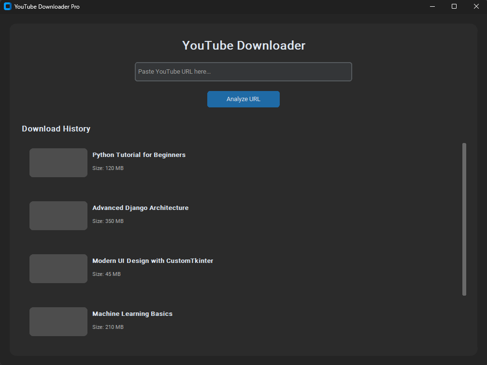

# 🚀 YouTube Video Downloader Pro

Ushbu loyiha YouTube platformasidan videolarni tezkor va qulay tarzda yuklab olish uchun yaratilgan zamonaviy desktop ilovadir. Python va CustomTkinter texnologiyalari asosida qurilgan bo'lib, u foydalanuvchiga yuqori darajadagi interfeys va barqaror ish faoliyatini taqdim etadi.



## ✨ Asosiy Imkoniyatlar (Features)

* **Asinxron Yuklab Olish (Multi-threading):** Videoni yuklash jarayoni alohida oqimda (thread) bajariladi, natijada dastur interfeysi yuklash vaqtida qotib qolmaydi.
* **Real-vaqt Progress Bar:** Yuklash jarayonining holati (foizlarda) grafik ko'rsatkich va matn orqali jonli ravishda ko'rsatiladi.
* **Thumbnail Preview:** Videoning sarlavhasi va muqova rasmini avtomatik ravishda aniqlash va ko'rsatish.
* **Yuklash Tarixi:** Yuklab olingan barcha videolar ro'yxatini boshqarish va dastur ichidan turib o'chirish imkoniyati.
* **Aqlli Sifat Tanlash:** Video uchun mavjud bo'lgan eng yaxshi formatni (720p gacha) avtomatik aniqlash.
* **Xatoliklar Nazorati:** Noto'g'ri URL yoki tarmoq muammolari haqida foydalanuvchini ogohlantirish tizimi.

## 🛠 Texnologik Stack

* **Python 3.10+:** Asosiy dasturlash tili.
* **CustomTkinter:** Zamonaviy va "Dark Mode" qo'llab-quvvatlaydigan UI elementlari.
* **yt-dlp:** Video yuklash uchun dunyodagi eng kuchli va barqaror kutubxona.
* **Threading:** Fondagi vazifalarni parallel bajarish uchun.

## 📥 O'rnatish va Ishga Tushirish

1.  **Loyiha nusxasini oling (Clone):**
    ```bash
    git clone [https://github.com/sizning_foydalanuvchi_nomingiz/youtube-downloader.git](https://github.com/sizning_foydalanuvchi_nomingiz/youtube-downloader.git)
    cd youtube-downloader
    ```

2.  **Virtual muhit yarating (Tavsiya etiladi):**
    ```bash
    python -m venv venv
    # Windows uchun:
    venv\Scripts\activate
    # Linux/macOS uchun:
    source venv/bin/activate
    ```

3.  **Kutubxonalarni o'rnating:**
    ```bash
    pip install -r requirements.txt
    ```

4.  **Dasturni ishga tushiring:**
    ```bash
    python app.py
    ```

## 📂 Loyiha Tuzilishi


* `app.py`: Ilovaning asosiy interfeysi va logikasi joylashgan fayl.
* `services/`: Yuklab olish va fayllarni boshqarish xizmatlari.
* `models/`: Ma'lumotlar modellari (Video klassi).
* `widgets/`: Ilovadagi maxsus UI komponentlari (VideoItem).

## 📜 Litsenziya

Ushbu loyiha MIT litsenziyasi ostida yaratilgan. Loyihani o'zingizning ehtiyojlaringiz uchun o'zgartirish va tarqatish huquqiga egasiz.

---
**Muallif:** Akhmad Akbarov